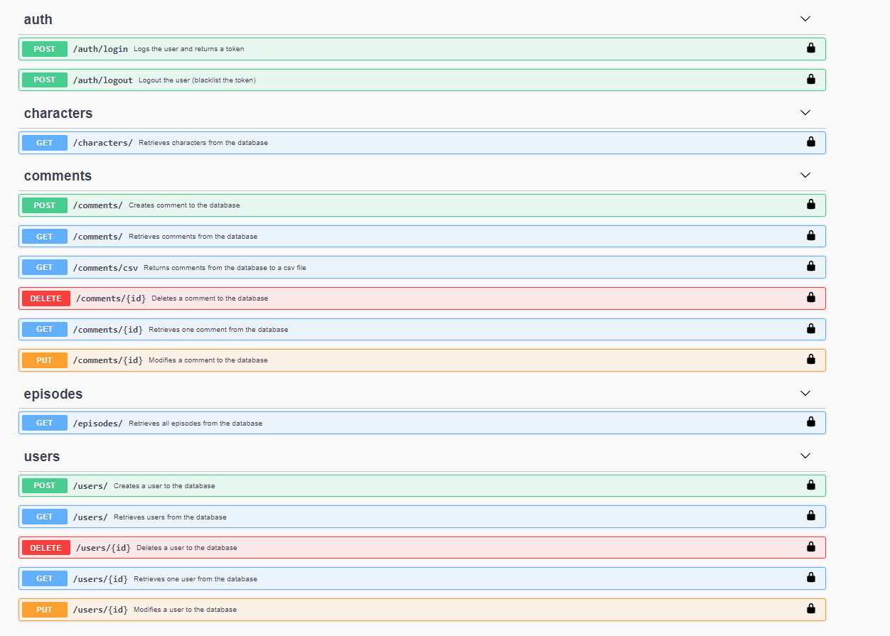

# Flask Project

## Installation

Use the package manager [pip](https://pip.pypa.io/en/stable/) to install foobar.

```bash
pip install -r requirements.txt
```

## Create database

Create a .env file based on .env.example file:

```bash
APP_SETTINGS=config.DevelopmentConfig
DATABASE_URL=sqlite:///app.db
```

TO create the database, run these commands:

```bash
python manager.py db init
python manager.py db migrate
python manager.py db upgrade
```

## Usage

### Import data

```bash
# With, in the same folder, the files rick_morty-characters_v1.json 
# and rick_morty-episodes_v1.json .
python data/import_data.py 

# With another files.
python data/import_data.py -c characters.json -e episodes.json
```

### Unit tests

```bash
python -m pytest tests/
```

### Run API server

```bash
python app.py
```

## Documentation for API Endpoints

All URIs are relative to *http://127.0.0.1:5000/api*

Class | HTTP request | Arguments | Payload | Description
------------ | ------------- | ------------- | ------------- | ------------- 
*RoutingApi* | **GET** /doc | | | Swagger UI documentation
*LoginUser* | **POST** /auth/login | | {"email": "string", "password": "string"} | Logs the user
*LogoutUser* | **POST** /auth/logout | | | Logout the user
*User* | **GET** /users | | | Retrieves users.
*User* | **POST** /users | | {"name": "string", "email": "string", "password": "string"} | Creates user
*Users* | **GET** /users/{user_id}  | | | Retrieves one user
*Users* | **PUT** /users/{user_id} | | {"name": "string", "email": "string", "password": "string"} | Modifies a user
*Users* | **DELETE** /users/{user_id} | | | Deletes a user
*Character* | **GET** /characters | start, limit, name, status, species, type, gender, episode_ids, comment_ids | | Retrieves characters. Can be paginated and filtered by character attributes.
*Episode* | **GET** /episodes | | | Retrieves all episodes
*Comment* | **GET** /comments | start, limit, comment, character_id, episode_id | | Retrieves characters. Can be paginated and filtered by comment attributes.
*Comment* | **POST** /comments | | {"comment": "string", "character_id": int, "episode_id": int} | Creates comment
*Comments* | **GET** /comments/{comment_id}  | | | Retrieves one comment
*Comments* | **PUT** /comments/{comment_id} | | {"comment": "string"} | Modifies a comment
*Comments* | **DELETE** /comments/{comment_id} | | | Deletes a comment
*CommentCsv* | **GET** /comments/csv | | | Retrieves comments from the database to a csv file



